# Secure Password Vault

A modern, security-focused credential management system built with Python, FastAPI, SQLAlchemy, Argon2, and authenticated encrypted vault storage.

The project provides a REST API for securely managing credentials, password security analysis, encrypted vault export/import, session-based authentication, audit logging, and controlled password retrieval.

> **Portfolio project:** This repository demonstrates practical application security, API engineering, cryptographic data protection, authentication, database design, automated testing, and operational verification.

---

## Overview

Secure Password Vault is designed as a local-first credential management service that protects stored credentials while exposing a structured REST API for authorized operations.

The application separates authentication, API routing, database access, cryptographic operations, password-security analysis, session management, and import/export functionality into dedicated modules.

The vault supports:

* Master-password initialization and authentication
* Session-based access control
* Encrypted credential storage
* Credential creation, retrieval, update, deletion, search, categories, and favorites
* Controlled password reveal
* Password-strength analysis
* Secure password generation
* Audit event recording
* Encrypted vault export and import
* Session invalidation after sensitive vault operations
* REST API documentation through Swagger/OpenAPI
* Automated unit and API testing
* Local SQLite persistence

---

## Key Features

### 🔐 Authentication and Session Security

* Master-password-based vault initialization
* Secure authentication using Argon2 password hashing
* Session-based authorization
* HTTP-only session cookie
* Session expiration handling
* Explicit vault lock/logout operation
* Unauthorized API requests return `401 Unauthorized`
* Sensitive vault operations can invalidate active sessions

### 🗄️ Credential Management

Credentials can be:

* Created
* Listed
* Searched
* Filtered by category
* Filtered by favorites
* Updated
* Deleted
* Accessed through controlled password-reveal endpoints

Credential metadata responses do not expose stored passwords.

### 🔑 Password Security

The security API provides:

* Password generation
* Password strength analysis
* Length analysis
* Character-class analysis
* Entropy estimation
* Common-password detection
* Repeated-character detection
* Sequential-pattern detection
* Security feedback

The application can distinguish weak passwords from stronger high-entropy passwords and provide actionable feedback.

### 🔒 Encrypted Vault Storage

The vault uses authenticated encryption for protected credential data.

The export/import mechanism uses:

* **AES-256-GCM** for authenticated encryption
* **PBKDF2-HMAC-SHA256** for key derivation
* Random cryptographic salt
* Encrypted export envelopes
* Integrity protection through authenticated encryption

Plaintext credential passwords are not included in exported vault files.

### 📋 Audit Logging

Security-relevant operations are recorded in an audit trail.

Examples include:

* Vault initialization
* Login
* Credential creation
* Credential access
* Credential updates
* Credential deletion
* Vault export
* Vault import

This provides an operational history for reviewing activity within the vault.

### 📦 Encrypted Backup and Restore

The application supports encrypted vault export/import.

The workflow was verified by:

1. Creating a demonstration credential
2. Rotating its password
3. Exporting the vault
4. Confirming the exported envelope contains encrypted data
5. Deleting the credential
6. Importing the encrypted vault
7. Re-authenticating after import
8. Confirming the credential was restored

### 📖 REST API and Swagger/OpenAPI

FastAPI automatically exposes interactive API documentation.

Available documentation endpoints include:

* `/docs`
* `/openapi.json`

The API is organized into dedicated functional routers for authentication, credentials, security, audit events, and transfer operations.

---

## Technology Stack

| Technology         | Purpose                       |
| ------------------ | ----------------------------- |
| Python 3.11+       | Application development       |
| FastAPI            | REST API framework            |
| Uvicorn            | ASGI application server       |
| SQLAlchemy         | Database ORM                  |
| SQLite             | Local persistent storage      |
| Pydantic           | Request/response validation   |
| Pydantic Settings  | Application configuration     |
| Cryptography       | Authenticated encryption      |
| AES-256-GCM        | Protected vault data          |
| PBKDF2-HMAC-SHA256 | Key derivation                |
| Argon2             | Master-password hashing       |
| Pytest             | Automated testing             |
| HTTPX              | API testing                   |
| pytest-cov         | Test coverage                 |
| Swagger/OpenAPI    | Interactive API documentation |

---

## Architecture

The application uses a layered structure that separates API concerns from authentication, persistence, security, and business logic.

```text
Client
  │
  ▼
FastAPI REST API
  │
  ├── Authentication API
  ├── Credential API
  ├── Security API
  ├── Audit API
  └── Transfer API
        │
        ▼
Application Services
  │
  ├── Vault Service
  ├── Password Security
  └── Import / Export
        │
        ├──────────────┐
        ▼              ▼
  Authentication    Cryptography
  Session Manager   AES-256-GCM
        │            PBKDF2
        ▼
    SQLAlchemy
        │
        ▼
     SQLite
```

---

## Project Structure

```text
secure-password-vault/
├── data/
│   └── .gitkeep
│
├── docs/
│   ├── images/
│   │   ├── api-health.png
│   │   ├── audit-events.png
│   │   ├── authenticated-status.png
│   │   ├── credential-list.png
│   │   ├── encrypted-export.png
│   │   ├── encrypted-import.png
│   │   ├── password-analysis-strong.png
│   │   ├── password-analysis-weak.png
│   │   ├── password-reveal.png
│   │   ├── swagger-api.png
│   │   └── unauthorized-access.png
│   └── videos/
│
├── src/
│   └── password_vault/
│       ├── api/
│       │   ├── app.py
│       │   ├── audit.py
│       │   ├── auth.py
│       │   ├── credentials.py
│       │   ├── dependencies.py
│       │   ├── security.py
│       │   └── transfer.py
│       │
│       ├── auth/
│       │   └── session.py
│       │
│       ├── models/
│       │   └── models.py
│       │
│       ├── schemas/
│       │   ├── audit.py
│       │   ├── auth.py
│       │   ├── credentials.py
│       │   ├── security.py
│       │   └── transfer.py
│       │
│       ├── security/
│       │   └── crypto.py
│       │
│       ├── services/
│       │   ├── import_export.py
│       │   ├── password_security.py
│       │   └── vault_service.py
│       │
│       ├── database.py
│       ├── main.py
│       └── __init__.py
│
├── tests/
│   ├── test_api_audit.py
│   ├── test_api_auth.py
│   ├── test_api_credentials.py
│   ├── test_api_security.py
│   ├── test_api_transfer.py
│   ├── test_audit_service.py
│   ├── test_crypto.py
│   ├── test_database.py
│   ├── test_import_export.py
│   ├── test_password_security.py
│   ├── test_session.py
│   └── test_vault_service.py
│
├── .gitignore
├── pyproject.toml
└── README.md
```

---

## API Endpoints

### Application

| Method | Endpoint        | Purpose               |
| ------ | --------------- | --------------------- |
| `GET`  | `/`             | API information       |
| `GET`  | `/health`       | Health check          |
| `GET`  | `/docs`         | Swagger UI            |
| `GET`  | `/openapi.json` | OpenAPI specification |

### Authentication

| Method | Endpoint                  | Purpose                    |
| ------ | ------------------------- | -------------------------- |
| `POST` | `/api/v1/auth/initialize` | Initialize the vault       |
| `POST` | `/api/v1/auth/login`      | Authenticate               |
| `POST` | `/api/v1/auth/logout`     | Lock the vault             |
| `GET`  | `/api/v1/auth/status`     | Check authentication state |

### Credentials

| Method   | Endpoint                                  | Purpose                       |
| -------- | ----------------------------------------- | ----------------------------- |
| `GET`    | `/api/v1/credentials`                     | List credentials              |
| `GET`    | `/api/v1/credentials/search`              | Search credentials            |
| `GET`    | `/api/v1/credentials/category/{category}` | Filter by category            |
| `GET`    | `/api/v1/credentials/favorites`           | List favorite credentials     |
| `POST`   | `/api/v1/credentials`                     | Create credential             |
| `GET`    | `/api/v1/credentials/{id}/metadata`       | Retrieve credential metadata  |
| `GET`    | `/api/v1/credentials/{id}/password`       | Controlled password retrieval |
| `PUT`    | `/api/v1/credentials/{id}`                | Update credential             |
| `DELETE` | `/api/v1/credentials/{id}`                | Delete credential             |

### Security

| Method | Endpoint                             | Purpose                   |
| ------ | ------------------------------------ | ------------------------- |
| `POST` | `/api/v1/security/generate-password` | Generate a password       |
| `POST` | `/api/v1/security/analyze-password`  | Analyze password security |

### Audit

| Method | Endpoint               | Purpose               |
| ------ | ---------------------- | --------------------- |
| `GET`  | `/api/v1/audit/events` | Retrieve audit events |

### Transfer

| Method | Endpoint                  | Purpose                |
| ------ | ------------------------- | ---------------------- |
| `POST` | `/api/v1/transfer/export` | Export encrypted vault |
| `POST` | `/api/v1/transfer/import` | Import encrypted vault |

---

## Requirements

* Python **3.11 or newer**
* `pip`
* Linux, macOS, or Windows
* A local writable project directory

The project was developed and verified with Python 3.14 on Linux.

---

## Installation

Clone the repository:

```bash
git clone https://github.com/bwachira649/secure-password-vault.git
cd secure-password-vault
```

Create a virtual environment:

### Linux / macOS

```bash
python3 -m venv .venv
source .venv/bin/activate
```

### Windows Command Prompt

```cmd
python -m venv .venv
.venv\Scripts\activate
```

### Windows PowerShell

```powershell
python -m venv .venv
.venv\Scripts\Activate.ps1
```

Upgrade packaging tools:

```bash
python -m pip install --upgrade pip
```

Install the project:

```bash
python -m pip install -e .
```

Install development and testing dependencies:

```bash
python -m pip install -e ".[dev]"
```

---

## Running the Application

The project provides the `password-vault` command.

Display help:

```bash
password-vault --help
```

Display the version:

```bash
password-vault --version
```

Start the API:

```bash
password-vault
```

The default server is:

```text
http://127.0.0.1:8000
```

### Development Mode

Run with automatic reload:

```bash
password-vault --reload
```

Specify a different host:

```bash
password-vault --host 0.0.0.0
```

Specify a different port:

```bash
password-vault --port 8080
```

The application can also be started through Python:

```bash
python -m password_vault.main
```

---

## API Documentation

After starting the server, open:

```text
http://127.0.0.1:8000/docs
```

FastAPI provides interactive Swagger UI documentation where available endpoints, request schemas, response models, and authentication-protected operations can be inspected.

OpenAPI JSON is available at:

```text
http://127.0.0.1:8000/openapi.json
```

---

## Basic API Workflow

### 1. Check application health

```bash
curl http://127.0.0.1:8000/health
```

Expected response:

```json
{
  "status": "healthy",
  "service": "secure-password-vault",
  "version": "0.1.0"
}
```

### 2. Initialize the vault

Use the authentication initialization endpoint to establish the master password.

### 3. Log in

Authenticate through:

```text
POST /api/v1/auth/login
```

The API establishes an authenticated vault session.

### 4. Manage credentials

Authorized clients can create, list, update, search, and delete credentials.

### 5. Lock the vault

Use:

```text
POST /api/v1/auth/logout
```

After the session is locked, protected endpoints reject unauthenticated requests.

---

## Security Model

The project applies multiple security layers rather than relying on a single protection mechanism.

### Master Password

The vault master password is protected using Argon2-based password hashing.

### Session Authentication

Authenticated requests use a session cookie.

The API checks the session before allowing protected operations.

### Encrypted Data

Sensitive vault data is protected using AES-256-GCM authenticated encryption.

### Key Derivation

PBKDF2-HMAC-SHA256 is used as part of the encrypted export/import key-derivation process.

### Authentication Enforcement

Protected credential operations require a valid authenticated session.

For example, attempting to access credentials after locking the vault produces:

```text
HTTP/1.1 401 Unauthorized
```

with:

```json
{
  "detail": "Authentication required."
}
```

### Auditability

Security-sensitive operations are recorded in an audit trail to support operational review.

---

## Password Security Analysis

The password analysis service evaluates multiple characteristics, including:

* Password length
* Estimated entropy
* Lowercase characters
* Uppercase characters
* Digits
* Symbols
* Common-password patterns
* Repeated characters
* Sequential patterns

Example weak-password analysis was performed using:

```text
password123
```

The analysis identified multiple weaknesses including insufficient length, missing uppercase characters, missing symbols, and a common-password pattern.

A separate high-entropy password was also analyzed to verify the stronger classification and positive security feedback.

> Demonstration passwords used during testing are not production credentials.

---

## Encrypted Export and Import

The transfer subsystem provides encrypted vault backup and restoration.

An exported vault contains an encrypted envelope rather than plaintext credentials.

The verified export metadata includes:

```text
Format: secure-password-vault
Version: 1
KDF: PBKDF2-HMAC-SHA256
Cipher: AES-256-GCM
Salt: Base64 encoded
Ciphertext: Encrypted
```

The import process was tested as a complete round trip:

```text
Create credential
      ↓
Update credential
      ↓
Export encrypted vault
      ↓
Delete credential
      ↓
Import encrypted vault
      ↓
Re-authenticate
      ↓
Verify restored credential
```

The import process also invalidates the previous session, requiring authentication again before protected data can be accessed.

---

## Testing

The project includes automated tests covering:

* Authentication
* Session handling
* Credential management
* Password security
* Cryptographic operations
* Database operations
* Audit logging
* Vault services
* Import/export
* API endpoints

Run the complete test suite:

```bash
python -m pytest
```

The verified test run completed with:

```text
197 passed
1 warning
```

The warning relates to a Starlette/httpx test-client deprecation notice and does not represent a test failure.

### Dependency Verification

Check installed dependency consistency:

```bash
python -m pip check
```

Expected:

```text
No broken requirements found.
```

### Python Compilation Check

Compile the application source:

```bash
python -m compileall -q src/password_vault
```

A successful command produces no error output.

---

## Project Evidence

The repository includes screenshots documenting actual application verification.

### API Health

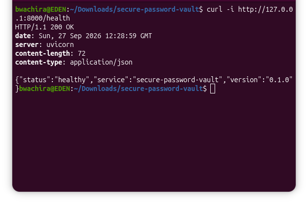

### Swagger / OpenAPI

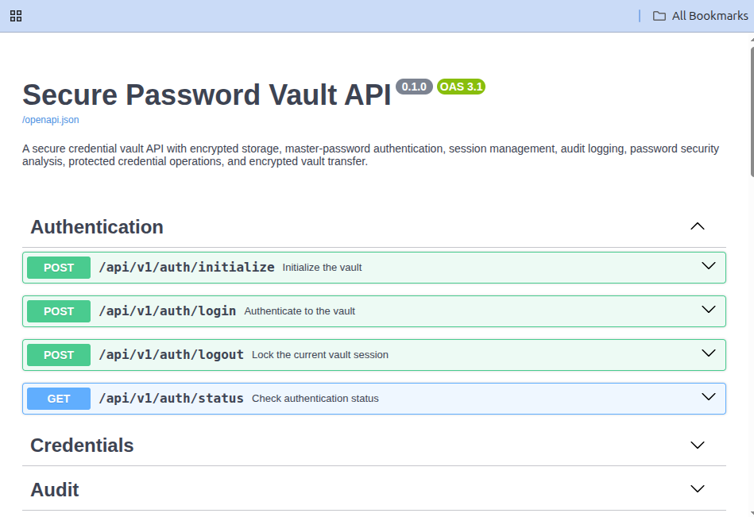

### Authenticated Session

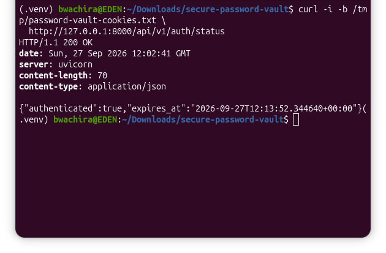

### Credential Management

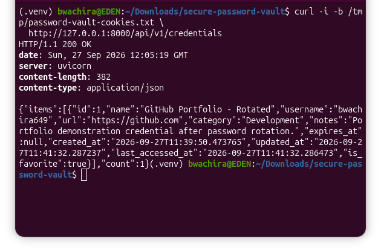

### Controlled Password Reveal

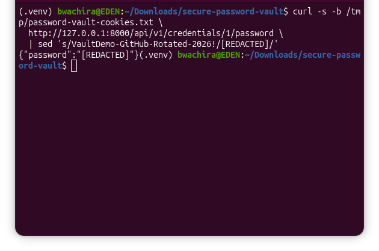

The password was redacted in the public evidence image.

### Audit Trail

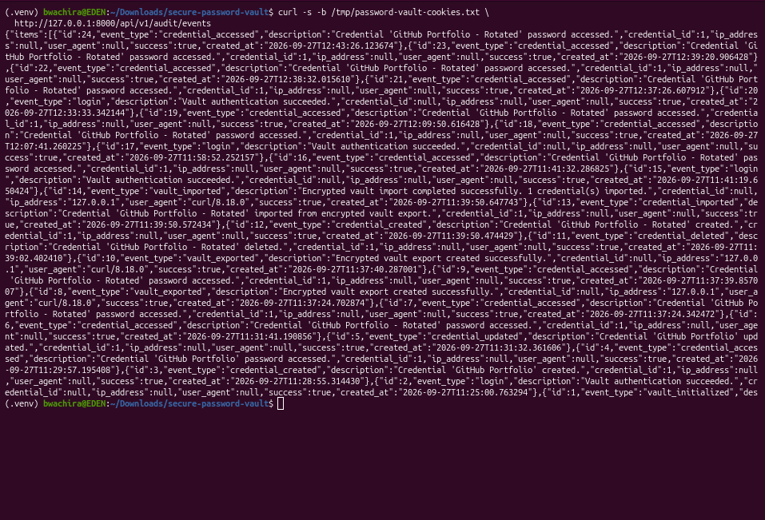

### Weak Password Analysis

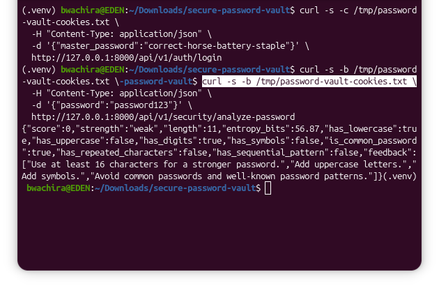

### Strong Password Analysis

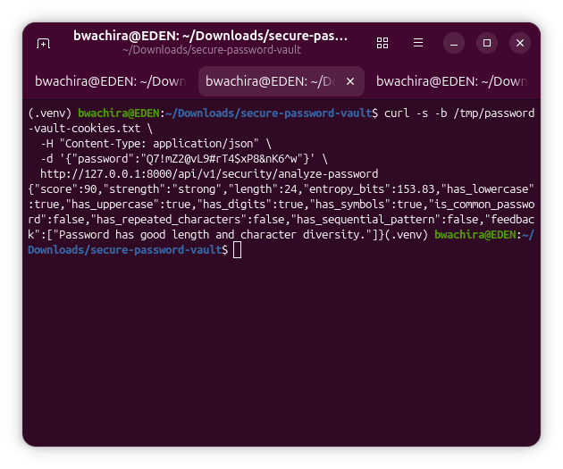

### Encrypted Export

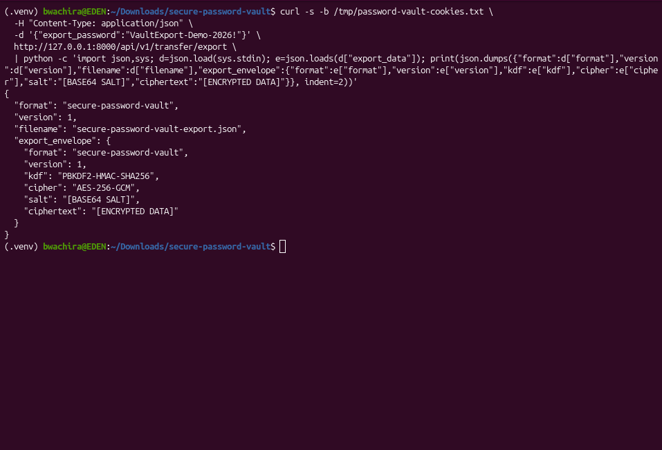

The evidence shows encryption metadata and does not expose plaintext credential data.

### Encrypted Import

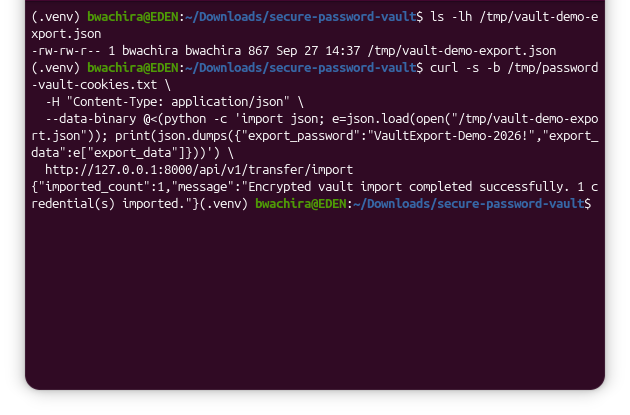

### Unauthorized Access Protection

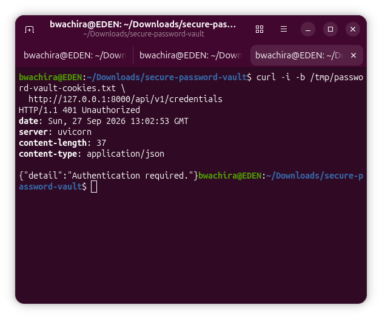

The evidence demonstrates that protected credential endpoints reject requests after the vault session has been locked.

---

## Data Protection and Repository Hygiene

Local vault data is intentionally excluded from version control.

The `.gitignore` configuration excludes:

```text
data/*
```

while retaining:

```text
data/.gitkeep
```

Other ignored artifacts include:

* Virtual environments
* Python bytecode
* Test caches
* Coverage files
* Build artifacts
* IDE metadata
* Environment files
* Logs
* Temporary files

Never commit a real production vault database, master password, session cookie, exported vault, or plaintext credential to source control.

---

## Demonstration Data

The repository verification used clearly identified demonstration credentials rather than real production secrets.

Examples were created specifically for portfolio testing and evidence capture.

Any credential or password visible in source code, tests, terminal demonstrations, or documentation should be treated as demonstration-only data.

---

## Development Verification

The project was verified locally through several independent checks:

```text
CLI help                         PASS
CLI version                      PASS
Python module execution          PASS
Python compilation               PASS
FastAPI health endpoint          PASS
Swagger/OpenAPI                  PASS
Vault initialization             PASS
Authentication                   PASS
Session status                   PASS
Credential creation              PASS
Credential update                PASS
Password reveal                  PASS
Password security analysis       PASS
Audit event retrieval            PASS
Encrypted export                 PASS
Encrypted import                 PASS
Session invalidation             PASS
Unauthorized access protection   PASS
Automated test suite              197 passed
Dependency consistency            PASS
```

---

## Design Goals

The project was designed around several practical engineering goals:

1. **Security by design**
   Sensitive operations are protected through authentication, authorization, cryptographic controls, and session management.

2. **Separation of concerns**
   API routes, schemas, services, database access, authentication, and cryptography are maintained in separate modules.

3. **Testability**
   Application components and API workflows are covered by automated tests.

4. **Operational visibility**
   Audit events and health endpoints provide useful operational information.

5. **Safe data handling**
   Local vault databases and other sensitive artifacts are excluded from source control.

6. **Practical API design**
   FastAPI and OpenAPI provide a documented interface that can be consumed by command-line clients, scripts, automation, or future frontends.

---

## Future Enhancements

Potential future improvements include:

* Configurable deployment environments
* More granular authorization policies
* Additional password-strength intelligence
* Secret rotation workflows
* Configurable session policies
* Rate limiting and brute-force protection
* Multi-user vault support
* Hardware-backed key protection
* Optional desktop or web client
* Security-event alerting
* Additional encrypted backup destinations
* Containerized deployment
* CI/CD security and test automation

These are intentionally separate from the current verified implementation.

---

## License

This project is licensed under the MIT License.

---

## Author

**Brian Wachira**

GitHub: [@bwachira649](https://github.com/bwachira649)

Email: [bwachira649@gmail.com](mailto:bwachira649@gmail.com)

---

## Repository

GitHub:

https://github.com/bwachira649/secure-password-vault
